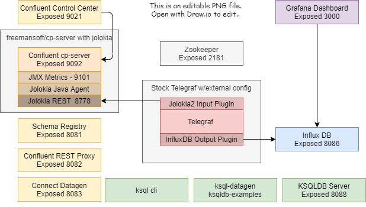
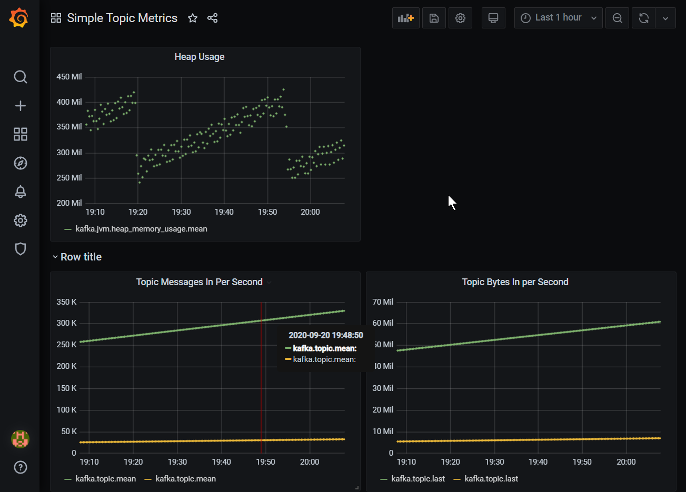

This project exposes _Kafka Topic_ metrics via JMX where they are picked up and stored in InfluxDB and exposed to user via Grafana.

Kakfa Brokers expose topic statistics two ways
* JMX Beans
* As messages in  _confluent-metrics_ topic

-----------------
## confluent-cp + Jolokia Docker Image
This project builds a Docker image on top of the _confluentinc/cp-server_ docker iamage. 
The Image exposes the Jolokia HTTP endpoint on port  ``` 8778 ```.
The Image will receive two tags, the cp-server version and the cp-serverversion appeneded with the build timestamp.
This lets start scripts use the same version number for this cp-server as it does for the rest of the confluent components.
You must run the _freemansoft/cp-server_ with these parameters to enable the Jolokia agent installed in this image.
> KAFKA_OPTS: '-javaagent:/opt/jolokia/jolokia-jvm-agent.jar=host=0.0.0.0'

You configure the Telegraf _Jolokia2_ plugin to use this endpoint as input where it can then be sent to any Telegraf output sink. See the sample telegraf.conf file in this GitHub repo associated with this Docker Image

### Building the cp-server w/Jolokia Docker Image
* Build a docker container that includes the Jolokia agent that exposes JMX over HTTP on port.
```
    cd cp-server-jolokia
    build.sh
    docker-compose -f docker-compose-kafka.yml up
```
### Docker Hub
You may find a pre-built docker image on Dockerhub.

-----------------
## Sample _telegraf.conf_ file.
Jolokia exposes about 3000 metrics. The sample _telegraf.conf_ file imports a significant subset of these.
telegraf.conf is configured baed on some 3-node work I did even though this repo only has a single broker:
* Poll the kafka broker nodes every 20 seconds instead of 10 seconds. This cuts the amount of data collected in half. The default seems excessive for metrics.
* Increase tinput buffer sizes 4x from the default.  The defaults are overrun by 7000 metrics when connected to three servers at the default buffer size.  This implies 17000 metrics.  The buffer sizes are now 4000/40000 which shold be twice what we need for a 3 node.  _I just guessed at all that_
* Push the data to a Containerized InfluxDB database

-----------------
# Exercising this repository

## Run the Kafka cluster and the Monitoring cluster
This project builds on a Docker Image built on top of the standard _confluentinc/cp-server_ docker image
1. Build a Kafka Broker Docker image with the _Jolokia_ Agent
    *  ``` bash build.sh ```
2. Start Kafka
    *  ```docker-compose -f docker-compose-kafka.yml up```
3. Verify *Kakfa* is up by looking at the _Confluent Dashboard_
    * http://localhost:9021/clusters/
3. Verify the **Jolokia Agent* is coughing up JMX bean data. Browse to the _Jolokia REST Endpoint_
    * Jolokia port 8778 is exposed to the docker host in the docker_compose sample. This will show all the beans available exposed by the _Kafka Broker_ All MBean data is exposed to the Jolokia REST endpoint. Topic statistics should exist for each topic. 
    * http://localhost:8778/jolokia/list
4. Start the monitoring ecosystem - Telegraf, InfluxDB and Grafana
    * ```docker-compose -f docker-compose-monitoring.yml up```
5. Verify the _Grafana_ UI is up.  The credentials are _admin/admin_ Browse to the _Grafana UI_ You can ignore the pasword change request for this demo.
    * http://localhost:3000/login 

-----------------
# Testing Grafana
Note: These steps are automated in the _quickstart_ subfolder

-----------------

## Configure Grafana to use InfluxDB as a source
1. Connect to the _Grafana Dashboard_
    * http://localhost:3000/login
    * admin/admin
    * skip the offered password change
1. Navigate to _Configuration --> Data Sources_
1. Click on _add data source_
1. Click on influxDB to start the connection creation
1. Create a data source that points at _InfluxDB_
    * Url:  http://influxdb:8086
    * Database: telegraf
    * Leave everything else blank
1. Click _Save and Test_

You can view the datasource configuration via the _Grafana REST API_
   http://localhost:3000/api/datasources/ 

-----------------
## Run Grafana Queries
1. Connect to the _Grafana Dashboard_ with your browser as described above
1. In the Grafana dashboard
    * Click on _Explore_ in the left menu
1. Make sure the DB droplist at the top is set to _InfluxDB_
1. On the _FROM_ line
    * Change the from to the desired metric like _cpu_ or _kafka\_topics_
1. On the _Select_ line
    * Change the field value to the metric you want to see
1. Click on _Run Query_

Example: __FROM__ _default_ _mem_ __WHERE__ __SELECT__ field(active) mean() __GROUP BY__ time($_interval...) _FORMAT AS_ Time series

### Sample Grafana Chart


-----------------
## Generate Test data in Kafka using Datagen
We can generate Kafka traffic using the demonstration Data Generator in the Confluence dashboard.
See this page https://docs.confluent.io/current/quickstart/ce-quickstart.html The following is a poor cheatsheet
1. Open Browser to the _Confluent Dashboard_
    *  http://localhost:9021/clusters/ 
1. Create a topic named _pageviews_
    *  ```Cluster1 --> Topics --> _+ Add a Topic_ --> name it _pageviews_ --> Press _Create with Defaults_ ```
1. Create a topic named _users_
    *  ```Cluster1 --> Topics --> _+ Add a Topic_ --> name it _users_ --> Press _Create with Defaults_ ```
1. Generate test data using the console and the datagen source
    * pageviews 
      1. Connect to Web Console
      1. Connect to Datagen Connector
          * Connect ```Clusters > Connect> connect-default >```
          * You will be on the connectors page
          * Press _Add Connector_ on the right
          * Find then button _DatagenConnector_ press _Connect_
      1. Set the name to _datagent-pageviews_
      1. On the next page _Add Connector_
          * Key converter class field, -> org.apache.kafka.connect.storage.StringConverter.
          * kafka.topic field ->  pageviews.
          * max.interval field ->  100. 
          * quickstart field ->  pageviews.
      1. Click Continue
      1. Review the connector configuration and click _launch_
    * users 
      1. Connect to Web Console
          * Connect ```Clusters > Connect> connect-default >``
          * You will be on the connectors page
          * Press _Add Connector_ on the right
          * Find the button _DatagenConnector_ press _Connect_
      1. Set the name to _datagen-users_
      1. On the next page _Add Connector_
          * Key converter class field, -> org.apache.kafka.connect.storage.StringConverter.
          * kafka.topic field ->  users
          * max.interval field ->  100 
          * quickstart field ->  users
      1. Click Continue
      1. Review the connector configuration and click _launch_
1. Verify 2 the two datagen connectors running
    * ```Cluster 1 --> connect --> connect-default```
 
-----------------
## Cleanup 
1. Bring down monitoring
  * ```docker-compose -f docker-compose-monitory.yml down ```
1. Bring down kafka
  * ```docker-compose -f docker-compose-kafka.yml down ```
1. If you only control-c the open windows then you may need
  * ```docker container prune ```
1. You can remove all the locally cached custom images with
  * ```docker rmi -f $(docker images | grep freemansoft/cp-server| awk '{print $3}' )```

-----------------
## References used creating ths project
* See _sample-jolokia-beans.json_ for all the mbean data coughed up by Jolokia for a unadulterated Kafka broker
* Jolokia / Telegraf sample config https://telegraf-kafka.readthedocs.io/en/stable/kafka_monitoring.html
* Jolokia / Telegraf sample config https://docs.wavefront.com/kafka.html
* Datagen data generator demo https://docs.confluent.io/current/quickstart/ce-quickstart.html

-----------------
## DockerHub Notes
The same script sits in two places to support DockerHub and human builds.
* /build.sh - for humans
* hooks/build - for DockerHub

freemansoft dockerhub builds are triggered whenever a semver tag is created with the format _x.y.z_ 

|Source Type | Source        | Docker Tag  | Dockerfile location | Build Context |
|------------|---------------|-------------|---------------------|---------------|
| tag        | /^\[0-9.\]+$/ | {sourceref} | Dockerfile          | /             |

Builds are automtically run when tags are created or moved. Tags are created/moved and pushed with the following commands
```
git tag -f -a <tagname>
git push -f --tags
```
Version numbers **should match the confluent version numbers** to make everyone's life simple

-----------------
## Videos
1. Intro https://youtu.be/w_FQD_pTybQ
1. Creating a cp-server Docker image that includes a Jolokia Java Agent https://youtu.be/SHx2PyUl5xE
1.  Configuring Telegraf with the telegraf.conf file https://youtu.be/2eX8ZAEM3sA
1. Displaying captured metrics in Grafana https://youtu.be/WpjCHCjGMhM

-----------------
## Grafana API
You should be abel to Create a grafana database confguration by sending a POST to http://localhost:3000/api/datasources
```
{
  "name": "InfluxDB",
  "type": "influxdb",
  "url": "http://influxdb:8086",
  "database": "telegraf",
}
```
@see https://grafana.com/docs/grafana/latest/http_api/data_source/

