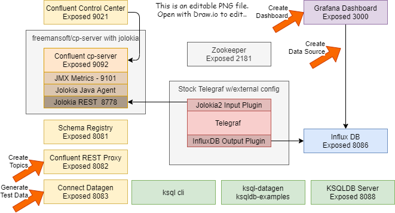

This directory sets up the topic and test data side of the 
[Confluent Docker quickstart](https://docs.confluent.io/current/quickstart/ce-docker-quickstart.html#ce-docker-quickstart)
in a series of scripts.  It then adds on metrics generation and capture , _Jolokia/Telegraf_ and a monitoring dashboard in _Grafana_.  This does not include the _Kafak Streams_ or _ksqlDB_ portion of the quick start.

Scripts in this folder let you run the Kafka quick start.
* Create Kafka topics called _users_ and _pagviews_
* Create data generator using the Kafka Connect data generator/connector.
* Use the quickstart user/pageview data generator to create traffic Kafka traffic
* Create a Grafana database source that points at the metrics in influxdb
* Create a Grafana dashboard that displayes a couple metrics.

## Prerequisites
* Kakfa is running locally in Docker.
    *  mostly likely using the docker-compose yml in the root folder of this project
* InfluxDB and Grafana are running locally in Docker
    *  mostly likely using the docker-compose yml in the root folder of this project

## Demo Docker Cluster Topology
We will be using the REST APIs highlighted in orange:



## Generating Data and Dashboards
The following steps use the REST APIs provided by Apache Kafka, the Kafka Connector and Grafana

| Step | Command |
| ---- | ------- |
| Open terminal and cd into quickstart folder | | 
| Create the topics | run ```bash 1_create_topics.sh```
| Create the quick start data generators so they can start creating data | run ```bash 2_create_and_run_generators.sh```
| Create the Grafana data source and dashboard | run ```bash 3_create_grafana_datasource_dashboards.sh```

### Monitoring
1. Open the Grafana engine to see metrics http://localhost:3000/?orgId=1
    * admin/admin in the example environment
1. Open the Confluence console to see the topics http://localhost:9021/clusters

## References
Data Generator JSON derived from 
* https://github.com/confluentinc/kafka-connect-datagen
* https://docs.confluent.io/current/quickstart/cos-quickstart.html

Kafka Topic JSON derived from 
* https://rmoff.net/2020/06/05/how-to-list-and-create-kafka-topics-using-the-rest-proxy-api/
* https://docs.confluent.io/5.3.1/connect/references/restapi.html

Grafana API
* https://grafana.com/docs/grafana/latest/http_api/auth/
* https://grafana.com/docs/grafana/latest/http_api/data_source/
* https://grafana.com/docs/grafana/latest/http_api/dashboard/

